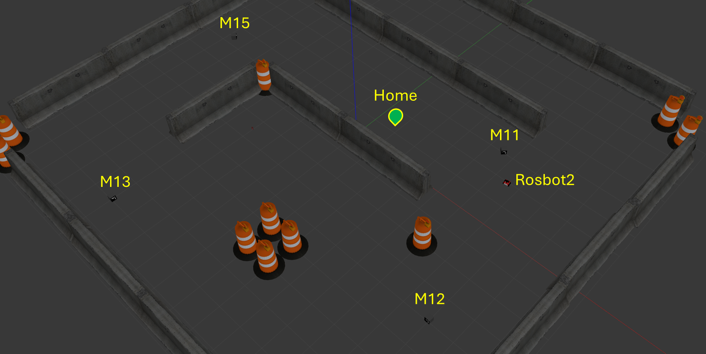
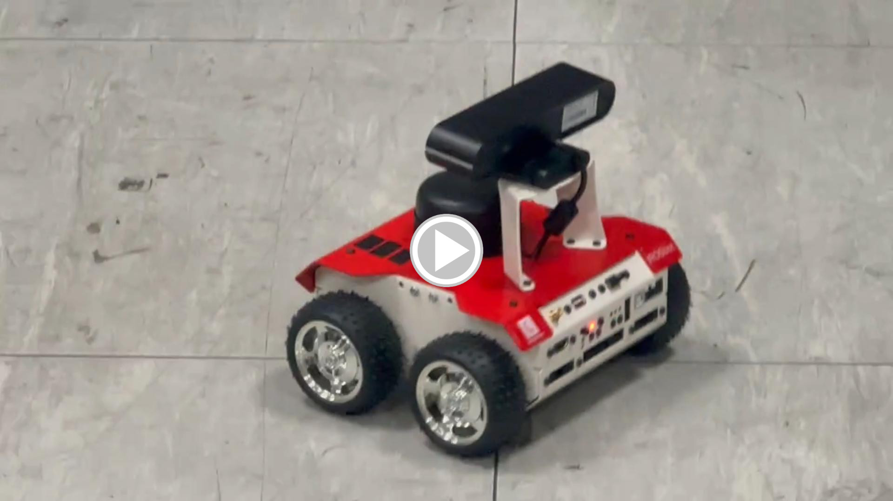

# Exprimental Robotics Course-Assignmet 2

In the second assignment of the Experimental Robotics course within the Robotics Engineering program at the University of Genoa, our focus shifted from manually defining task order and logic, as was done in assignment 1, to employing the ROSPlan package for automating the process. This transition enabled us to streamline the execution of tasks by utilizing PDDL (Planning Domain Definition Language) planners integrated into the ROSPlan package.

The assignment began with a comprehensive exploration of how to articulate the world and problem instances through the creation of .domain and .problem files. These files served as the foundation for the subsequent application of the ROSPlan PDDL planner. By leveraging this planner, we were able to systematically generate a sequence of actions that, when executed, would transition the initial state of the world to a desired goal state.

Furthermore, a crucial aspect of our learning process involved understanding how to employ the dispatcher feature within the ROSPlan package. This feature facilitated the dynamic selection and execution of the appropriate action server, aligning with the current task dictated by the planner's solution. This dynamic adaptation enhanced the flexibility and efficiency of our robotic applications.

In summary, the second assignment provided us with a deepened understanding of advanced ROS features and the integration of ready-to-use packages like ROSPlan. Through this exploration, we gained valuable insights into creating complex ROS applications capable of solving real-world robotics challenges. The integration of automated planning not only showcased the power of robotics in problem-solving but also equipped us with practical skills applicable to a variety of scenarios within the field.
## Table of Contents 

1. [Assignment Description](#Assignment-Description)
2. [PART 1-Software Architecture](#PART-1-Software-Architecture)
    - [1-SENSE](#1-SENSE)
    - [2-PLAN](#2-PLAN)
    - [3-ACT](#3-ACT)

3. [PART 2-The Code Implementation (C++/Python)](#PART-2-The-Code-Implementation-(C++/Python))
    - [1- ROSPlan Nodes](#1-ROSPlan-Nodes)
    - [2- Plan Launcher Node](#2-Plan-Launcher-Node)
    - [3- Interface Nodes](#3-Interface-Nodes)
    - [4- Action Server Nodes](#3-Action-Server-Nodes)

5. [PART 3-The Gazebo Simulation](#PART-4-The-Gazebo-Simulation)
    - [Step 1-Prerequisite and Packages](#Step-1-Prerequisite-and-Packages)
    - [Step 2-How to Run the Simulation](#Step-2-How-to-Run-the-Simulation)
6. [PART 4-The Real Implementation on Rosbot2 Robot](#PART-4-The-Real-Implementation-on-Rosbot2-Robot)
    - [Step 1-Running the Robot Sensors Drivers](#Step-1-Running-the-Robot-Sensors-Drivers)
    - [Step 2-Debugging Our Algorithm and the Code Implementation](#Step-2-Debugging-Our-Algorithm-and-the-Code-Implementation)
    - [Step 3-Final Test](#Step-3-Final-Test)
7. [PART 5-Suggestions for Improvment](#PART-5-The-Suggestion-for-Improvment)
    - [Navigation Algorithm Improvement](#Navigation-Algorithm-Improvement)
    - [Planning Strategy Enhancement](#Planning-Strategy-Enhancement)
    - [Handling Plan Failures](#Handling-Plan-Failures)
8. [Group Members](#Group-Members)
9. [License](#License)

<a name="Assignment-Description"></a>
## Assignment Description

The Rosbot2 robot is tasked with accomplishing its mission, which involves locating a sequence of markers within the environment.The robot initiates its mission from the home position, locates the markers, and subsequently returns to the home position:

- Leave the Home,
- Locate Marker 11,
- Locate Marker 12,
- Locate Marker 13,
- Locate Marker 15,
- Back to Home.

<p align="center">

</p>


<a name="PART-1-Software-Architecture"></a>
## PART 1-Software Architecture

In this section, we'll break down our robot's software architecture using the sense-plan-act diagram. We'll go through each part step by step to make it easy to follow.
<p align="center">

</p>

<a name="1-SENSE"></a>
### 1-SENSE

In the sensing part, the robot uses its sensors, like the RGB camera, to spot markers. It also uses the LIDAR sensor to find obstacles and move along walls. The robot figures out where it is in the environment using data from the Odometry sensor and goes to the desired spot.

<a name="2-PLAN"></a>
### 2-PLAN
In the planning phase, we make use of the ROSPlan package. This package takes in the domain.pddl and problem.pddl and attempts to find a solution to the problem. The following displays the results of the planner service:
<p align="center">
 
</p>

<a name="3-ACT"></a>
### 3-ACT
In the action phase, the plan dispatcher component of the ROSPlan package receives the task list created by the planner and activates the relevant action servers to perform the current task.

Tasks fall into two categories:

- **Navigation Task:** This involves guiding the robot from one waypoint to another. We achieve this using the BUG0 algorithm, which consists of two behaviors: go-to-point and wall-follow.

- **Detection Task:** This task entails rotating the robot until its camera identifies the target marker. We employ the aruco package for marker detection, which uses QR codes.
    
<a name="PART-2-The-Code-Implementation-(C++/Python)"></a>
## PART 2-The Code Implementation (C++/Python) 

The image below illustrates the rqt graph of the robot's software, displaying all active nodes,topics, services and action servers throughout the simulation.

<p align="center">

</p>

<a name="1-ROSPlan_Nodes"></a>
**1- ROSPlan Nodes**

The ROSPlan package is a collection of tools for AI Planning that seamlessly integrates with the ROS framework.It comprises five main nodes:

-`Knowledge Base Node:` This component is used for storing a PDDL model, including both the domain model and the current problem instance.

-`Problem Interface Node:` The Problem Interface node generates a problem instance.

-`Planner Interface Node:` Serving as a wrapper for the AI Planner, this node interacts with the planner through a service. If a solution is found, the service returns true. The Planner Interface feeds the planner with a problem instance and retrieves the domain information using services provided by the Knowledge Base.

-`Parsing Interface Node:` This node converts planner output into a plan representation suitable for execution. It facilitates the dispatching of actions to different parts of the system.

-`Plan Dispatch Node:` This component involves plan execution and the connection of individual actions to the processes responsible for their execution. An implementation of the Plan Dispatch node subscribes to a plan topic and the action feedback provided by the node that practically implements the action.

<a name="2-Plan_Launcher_Node"></a>
**2- Plan Launcher Node**

This node uses four services from the ROSplan system to make a plan ready for execution in ROS. The services are:

-`/rosplan_problem_interface/problem_generation_server:` Problem Generator Service.

-`/rosplan_planner_interface/planning_server:` Plan Creator Service.

-`/rosplan_parsing_interface/parse_plan:` Plan Parser Service .

-`/rosplan_plan_dispatcher/dispatch_plan:` Plan Executor Service. 

``` cpp
PlanLauncher Class{
    functinality {
        Initialize services;
        bool done = False;

        while (!done){
            Trigger services to start the plan;
            Dispatch the plan;
            Update the status of success and goal achievement;
        }
    }
}
```

<a name="3-Interface_Nodes"></a>
**3- Interface Nodes**

In the ROSplane package, the dispatcher plays a crucial role in orchestrating the execution of actions based on the current plan. To facilitate this, two essential interfaces, namely `MoveToInterface` and `FindMarkerInterface`, have been introduced and integrated into the dispatcher. The `FindMarkerInterface` is a component of the ROSPlan library within the namespace `KCL_rosplan`. This interface inherits from the `RPActionInterface` class, signifying its involvement in managing ROSPlan action interfaces. The constructor, `FindMarkerInterface(ros::NodeHandle &nh)`, initializes the object with a ROS NodeHandle reference. The pivotal method, `concreteCallback(const rosplan_dispatch_msgs::ActionDispatch::ConstPtr& msg)`, is responsible for processing messages from the `action_dispatch` topic. By overriding the corresponding method in `RPActionInterface`, it effectively handles the execution of the `detect_marker` action.

```cpp
#include "../include/dispatch_interface/FindMarkerInterface.h"

bool FindMarkerInterface::concreteCallback(msg) {
    get the id of the marker to found from msg;
    create actionGoal goal;
    set the ID of the marker to found;
    create actionClient;
    send goal to the FindMarker action server
    wait result for 60 seconds;
    if(result){
        action complete;
        return true;
    }
    else {
        action did not complete;
        return false;
    }
}

int main(){
    init node
    define an instance of the FindMarkerInterface 
    run the FindMarkerInterface
    return 0;
}
```

Similarly, the `MoveToInterface` serves as another crucial interface in the ROSPlan library, designed to handle the `MoveTo` action. Like its counterpart, it inherits from the `RPActionInterface` class, emphasizing its role in action interface management. The constructor, `MoveToInterface(ros::NodeHandle &nh)`, initializes the object with a ROS NodeHandle reference. The method `concreteCallback(const rosplan_dispatch_msgs::ActionDispatch::ConstPtr& msg)` is pivotal, listening to and processing messages from the `action_dispatch` topic. By overriding the corresponding method in `RPActionInterface`, it takes charge of the execution of the `MoveTo` action. The seamless integration of these interfaces with the dispatcher ensures a streamlined and coherent execution of actions according to the specified plan in the ROSplane package.

```cpp
#include "../include/dispatch_interface/MoveToInterface.h"

bool MoveToInterface::concreteCallback(msg) {
    
    implementation of the action in the concreteCallback method
    setting target position and orientation based on the waypoint
        if(msg.value == wp0){
            set goal for waypoint 0;
        }else if(msg.value == wp1){
            set goal for waypoint 1;
        }else if(msg.value == wp2){
            set goal for waypoint 2;
        }else if(msg.value == wp3){
            set goal for waypoint 3;
        }else if(msg.value == wp4){
            set goal for waypoint 4;
        }          
        send goal to BUG0 action server
        sleep(1);
        waitForResult();
        return true;
}

int main(){
    init node
    define an instance of the MoveToInterface 
    run the MoveToInterface
    return 0;
}
```

<a name="4-Action_Server_Nodes"></a>
**4- Action Server Nodes**

In the implementation of the robot's task execution, two distinct action servers are utilized to handle the dispatched tasks. To enable robot navigation, the `BUG0 algorithm` is employed, allowing the robot to traverse between specified waypoints. The BUG0 algorithm dynamically switches between two modes: `Go-to-Point` and `Wall-Follow`, contingent on the readings from the `LIDAR sensor`. When the forward distance falls below a `predefined threshold`, indicating the presence of an obstacle, the robot initiates Wall-Follow behavior. Conversely, if the forward distance surpasses the threshold, the robot adjusts its linear and angular velocity based on the error to effectively move towards the target point.

`Go-to-Point` Behaviour:
``` py

def main():
    init node
    define the required publishers and subscribers

    rate = rospy.Rate(20)
    while not rospy.is_shutdown():
        if not active_:
            continue
        else:
            set the desired_position for x and y
            if state_ == 0:
                follow the fix_yaw(desired_position) behavior
            elif state_ == 1:
                follow the go_straight_ahead(desired_position) behavior
            elif state_ == 2:
                task completed
            else:
                rospy.logerr('Unknown state!')

        rate.sleep()

if __name__ == '__main__':
    main()
```

`Wall-Follow` Behaviour:
``` py

def main():
    init node
    define the required publishers and subscribers

    rate = rospy.Rate(20)
    while not rospy.is_shutdown():
        if not active_:
            rate.sleep()
            continue
        else:
            msg = Twist()
            if state_ == 0:
                msg = find_wall()
            elif state_ == 1:
                msg = turn_left()
            elif state_ == 2:
                msg = follow_the_wall()
            else:
                rospy.logerr('Unknown state!')

            pub_.publish(msg)

        rate.sleep()

if __name__ == '__main__':
    main()
```

Simultaneously, for marker detection, the `Aruco Marker detector` algorithm, integrated with `OpenCV`, is utilized. This algorithm modulates the robot's angular velocity to facilitate a turning motion until it locates the Aruco marker. 

``` py
class FindMarker(object):	

	# Constructor
	def __init__(self, name):
		initialization
		define the action server
		define the required publishers and subscribers
		start the server
	
	# Callback function for executing the action
	def execute_callback(self, goal):
		rospy.loginfo("Start the action for searching the target marker: %d" % goal.markerId)
		send the target markerId for the Aruco MarkerPublisher node

		while(marker is not found):
			rotate the robot at a constant angular velocity
		    when the marker is found, stop the robot

		send the action result

if __name__ == '__main__':
	init node
	define an instance of FindMarker
	rospy.spin()
```

Both of these functionalities are encapsulated within their respective action servers, orchestrated by the ROSPlan dispatcher through designated interfaces. Upon completing a task, each action server communicates feedback to the dispatcher, signaling the completion of the current task and enabling the dispatcher to fetch the subsequent task in the predefined plan. This cohesive integration ensures the seamless execution of tasks, combining navigation and marker detection in a versatile and efficient manner.

<a name="PART-3-The-Gazebo-Simulation"></a>
## PART 3-The Gazebo Simulation

<a name="Step-1-Prerequisite-and-Packages"></a>
### Step 1-Prerequisite and Packages:
- ROS Noetic
- OpenCV
- ROSPlan package (https://github.com/KCL-Planning/ROSPlan)
- aruco_ros package (https://github.com/CarmineD8/aruco_ros) (https://github.com/pal-robotics/aruco_ros/tree/melodic-devel)
- rosbot_description package (https://github.com/CarmineD8/robot_description)


<a name="Step-2-How-to-Run-the-Simulation"></a>
### Step 2-How to Run the Simulation:

Run the run.launch file from the exp_assignment2 package's launch directory to initialize ROS nodes, Gazebo simulator, RViz visualization tool, and all necessary nodes, including the ROSPlanner, action servers, and more:

``` bash
 roslaunch exp_assignment2 run.launch
```

Upon initiating all the necessary nodes, the planner endeavors to solve the problem within the current domain. If a solution is successfully identified, the dispatcher utilizes this solution to retrieve the subsequent task for the corresponding action servers through the configured interfaces. Assuming a smooth execution, the robot commences its movement from one waypoint to another. Upon reaching a waypoint, it rotates until the target marker is detected. This iterative process continues, with the dispatcher fetching and assigning tasks to the action servers. Upon detecting the final marker, Marker id 15, the robot returns to the home position, culminating in the termination of the entire process.

 Video
=============
▶ Click to watch the video:
[](https://youtu.be/xeEflY8YUeM "real test")

<a name="PART-4-The-Real-Implementation-on-Rosbot2-Robot"></a>
## PART 4-The Real Implementation on Rosbot2 Robot

We performed hands-on experiments using our proposed algorithms on the Rosbot2 robot, encompassing multiple stages. These stages encompassed initializing the robot sensor drivers, assessing various sensor types like the RGBD camera and laser scanner, aligning the units in both simulation and the real world, set the markers position, and evaluating the effectiveness of our algorithms across diverse scenarios. The hands-on experience proved exceptionally beneficial for our team.

<a name="Step-1-Running-the-Robot-Sensors-Drivers"></a>
### Step 1-Running the Robot Sensors Drivers:

``` bash
 roslaunch tutorial_pkgall.launch
```
<a name="Step-2-Debugging-Our-Algorithm-and-the-Code-Implementation"></a>
### Step 2-Debugging Our Algorithm and the Code Implementation:

In the real-world application of our algorithms, we take the chance to fix issues and adjust settings to match actual situations. For instance, we fine-tune settings like how fast the robot can turn during the search to make sure the ArUco detector doesn't miss the marker due to quick rotations. We also make changes to the BUG0 algorithm's thresholds, such as `obstacle_threshold`, `free_way_threshold`, `alignment_threshold`, and `distance_threshold`. These changes help the robot smoothly switch between going to a point and following a wall, a crucial aspect of the algorithm. Additionally, we carefully tweak the laser scanner's data range to accurately align with the Rosbot2 frame, improving the robot's ability to detect obstacles and walls in the real world. This careful adjustment ensures our algorithms work well in different real-world situations, making our system strong and adaptable.

<a name="Step-3-Final-Test"></a>
### Step 3-Final Test:

After successfully completing all the preceding steps, we conducted the final test of our algorithms. The Rosbot2 robot navigated smoothly in the environment, exhibiting the expected behaviors based on our algorithms. The robot successfully accomplished its task.

 Video
=============
▶ Click to watch the video:
[](https://youtu.be/9APw2E8lbek "real test")

<a name="PART-5-The-Suggestion-for-Improvment"></a>
## PART 5-Suggestions for Improvment

 <a name="Navigation-Algorithm-Improvement"></a>
- **Navigation Algorithm Improvement:** Instead of relying on a straightforward navigation algorithm like BUG0, exploring alternatives such as SLAM (Simultaneous Localization and Mapping) could significantly enhance our robot's capabilities. SLAM enables the creation of a local map of the environment, facilitating effective localization of the robot and obstacles. This approach would contribute to safer navigation in unknown environments by aiding the robot in avoiding obstacles.

<a name="Planning-Strategy-Enhancement"></a>
- **Planning Strategy Enhancement:** Moving beyond a basic planning algorithm that follows a predetermined sequence of markers, we can introduce more sophisticated criteria. Considering factors like the distance from the marker during the search process could improve efficiency and conserve the robot's time and energy. Additionally, transitioning from an offline planner to an online one allows for adaptability to real-time changes in the environment, enabling the system to handle more complex missions effectively.

<a name="Handling-Plan-Failures"></a>
- **Handling Plan Failures:** Current assumptions neglect the possibility of plan failures, a critical consideration for a robot exploring unknown environments. Scenarios such as the robot's inability to locate a marker, collisions with obstacles, or difficulties navigating to a specific point due to an unsafe path or location should be addressed. In such situations, it is imperative for the robot to send feedback to the planner, triggering replanning. Alternatively, the robot may notify the control center for intervention or manual control to ensure efficient response in the face of unexpected challenges.


<a name="Group-Members"></a>
## Group Members: 

**Robotics Engineering, University of Genoa, Italy**
- Saeed Abdollahi 🆔 ([@Saeed](https://github.com/SaeidAbdollahi)) 
- Danial Sabzevari 🆔 ([@dssdanial](https://github.com/dssdanial)) 
- Parinaz Ramezanpour 🆔 ([@ParinazRmp](https://github.com/ParinazRmp))
- Amir Rad 🆔 ([@AmirRad1998](https://github.com/AmirRad1998)) 
- Ehsan Fatemi 🆔 ([@ehsan51](https://github.com/ehsan51)) 

<a name="License"></a>
## License
This project is licensed under the MIT License - see the LICENSE file for details.
